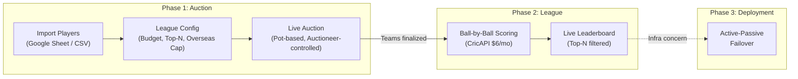
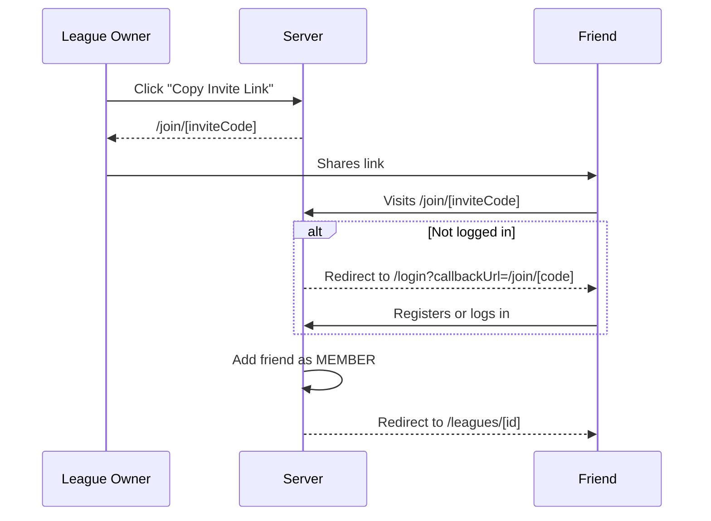
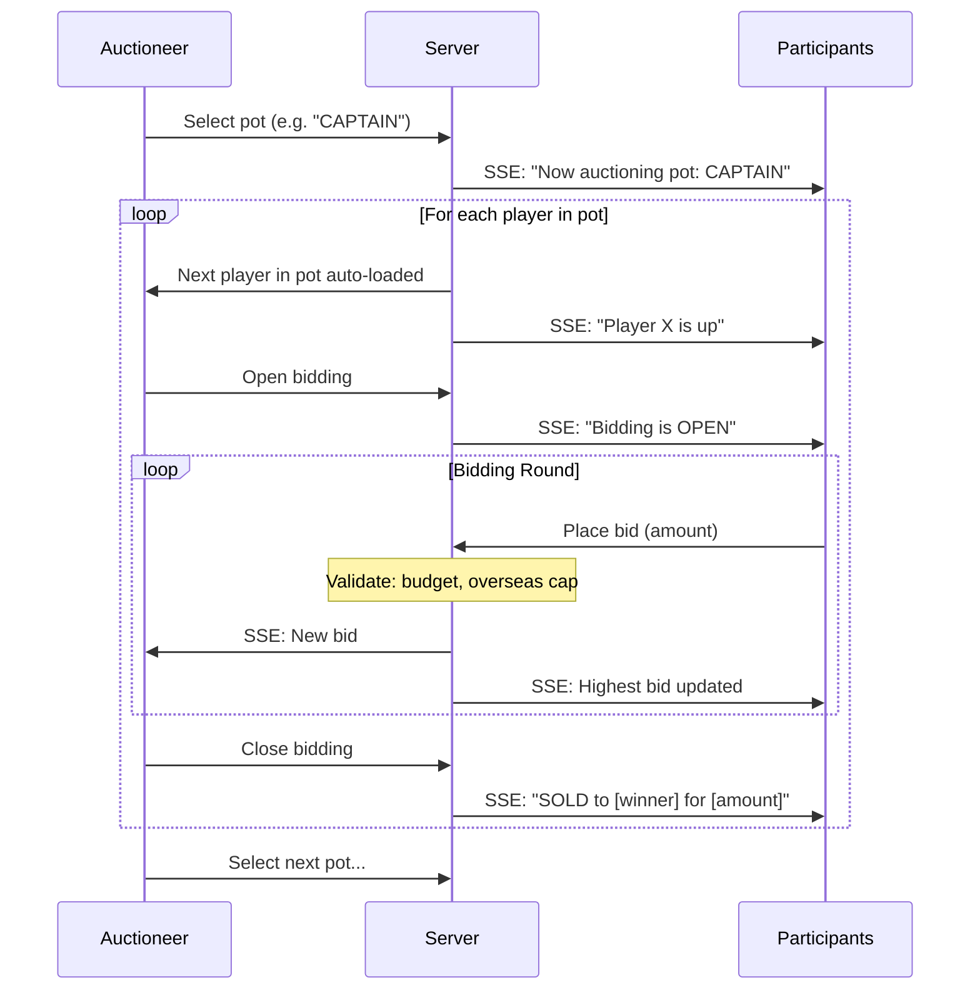
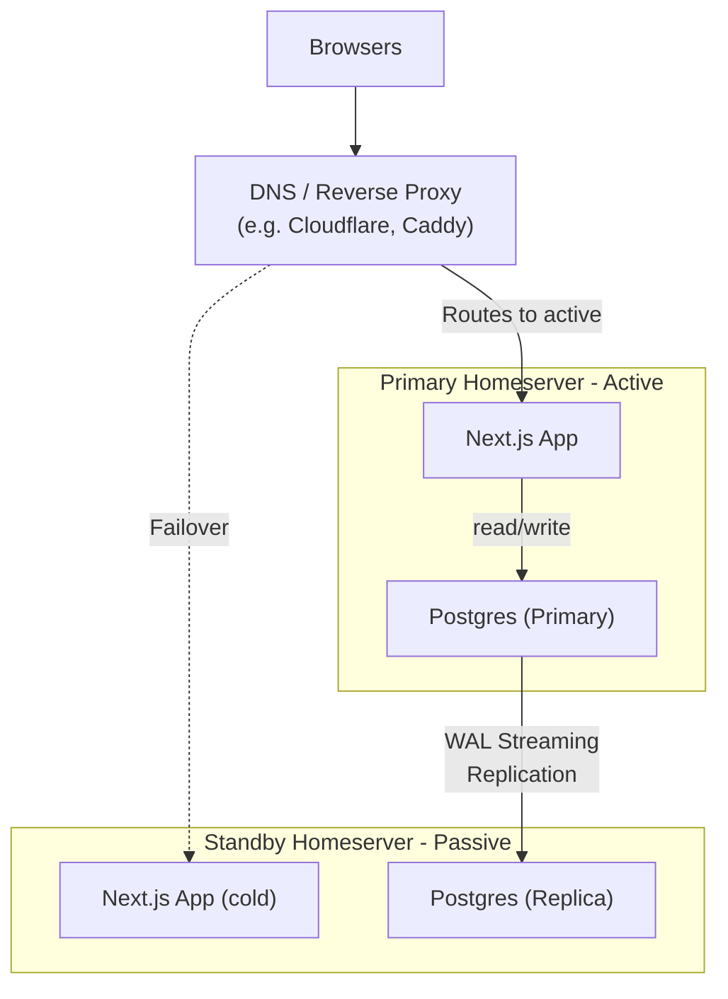

# Player Auction + Fantasy League -- Full Architecture Plan

## Current Implementation Status

| Feature | Status |
|---|---|
| Auth (login / register) | Done |
| League CRUD (create, detail, config) | Done |
| Magic invite links (`/join/[code]`) | Done |
| Player import (Google Sheet URL + CSV upload) | Done |
| Pot-based auction (auctioneer controls, SSE) | Planned |
| Live bidding (real-time via SSE) | Planned |
| CricAPI integration (ball-by-ball data) | Planned |
| Fantasy scoring engine (standard IPL rules) | Planned |
| Leaderboard / team pages / match views | Planned |
| Active-passive failover (two homeservers) | Planned |
| Trading between teams | Future |

---

## Three-Phase Overview

---

## Tech Stack

- **Framework**: Next.js (App Router, TypeScript, Tailwind CSS)
- **Database**: Postgres 15 in Docker
- **ORM**: Prisma
- **Auth**: NextAuth.js (credentials provider)
- **Real-time**: Server-Sent Events (SSE) for auction bids and live scoring
- **Cricket Data**: CricAPI paid plan (~$6/month, 2,000 calls/day)
- **Player Import**: Google Sheets "Publish to Web" CSV URL + manual CSV upload
- **Deployment**: Docker Compose, with Phase 3 active-passive failover across two homeservers

---

## CSV / Google Sheet Column Mapping

The app expects these columns (matching your existing sheet):

| CSV Column | DB Field | Required | Notes |
|---|---|---|---|
| Sl. No | `slNo` | No | Display ordering, auto-generated if missing |
| Name | `name` | Yes | Player name |
| Base Price | `basePrice` | Yes | Numeric, currency symbols stripped |
| Pos | `position` | No | e.g. Batsman, Bowler, All-rounder, WK |
| Country | `country` | Yes | Used to enforce overseas cap (any non-"India" = overseas) |
| Auction Price | `soldPrice` | No | Pre-filled if re-importing after auction |
| Bowling Style | `bowlingStyle` | No | e.g. Right-arm fast, Left-arm spin |
| Batting Style | `battingStyle` | No | e.g. Right-hand bat, Left-hand bat |
| Team | `iplTeam` | No | Current IPL franchise |
| Pot | `pot` | Yes | Auction grouping, e.g. "CAPTAIN", "AR-1", "BAT-2" |

The `pot` field drives the auction flow -- the auctioneer selects a pot, and the app presents players in that pot sequentially.

---

## Phase 1: Auction

### League Setup & Configuration

Before the auction starts, the league owner configures:

- **Budget per team**: Total purse each team can spend (default: 1,00,00,000 / 1 Cr)
- **Top-N scoring rule**: Only the top N players (by fantasy points) from each team count toward the leaderboard in any given match. Configurable via a number input. Example: if N=7 and a team has 11 players, only the 7 highest-scoring players' points count.
- **Overseas player cap**: Maximum number of overseas (non-Indian) players allowed per team. Configurable via a slider (range: 0 to total roster size, default: 4, matching IPL rules). Enforced during bidding -- if a team hits the cap, they cannot bid on more overseas players.
- **Scoring rules**: JSON-based override of default IPL fantasy scoring (optional advanced setting).
- **Google Sheet URL**: Paste the "Publish to Web" CSV URL for live player sync.

All of these are stored on the `League` model and can be edited until the auction starts.

### Player Import (Google Sheet / CSV)

The league owner imports players via two methods during the SETUP phase:

1. **Google Sheet URL**: Paste any Google Sheets URL (edit link, share link, or published link). The server converts it to a CSV export URL, fetches the data, and parses it. The sheet URL is saved on the league for future re-imports.
2. **CSV file upload**: Direct file upload as a fallback.

Both methods use the same CSV parser (`src/lib/csv-parser.ts`) which does flexible header matching (case-insensitive, multiple aliases per column). Re-importing replaces all QUEUED (unsold) players -- already-sold players from a prior auction are preserved.

- **Endpoint**: `POST /api/leagues/[id]/players/import`
- **Google Sheets converter**: `src/lib/sheets.ts` -- handles `/edit`, `/pub`, `/export` URL variants

### League Membership (Invite Links)

Members join a league via magic invite links. The league owner copies a link from the league detail page and shares it (e.g. via WhatsApp).

Each league has a unique `inviteCode` field (auto-generated cuid). The `/join/[code]` server page looks up the league, adds the authenticated user as a MEMBER (idempotent), and redirects to the league detail page. The middleware preserves `callbackUrl` through the auth flow so unauthenticated users land back on the join page after logging in or registering.

### Pot-Based Auction Flow

The auctioneer workflow is organized around pots:

### Auctioneer Dashboard

- **Pot selector**: Dropdown/tabs showing all pots (e.g. CAPTAIN, AR-1, BAT-1, BOWL-1...) with count of remaining players in each
- **Current pot queue**: List of players in the selected pot, with sold/unsold status
- **Current player card**: Name, position, country, batting/bowling style, IPL team, base price
- **Bid controls**: "Open Bidding" / "Close Bidding" / "Skip" / "Undo Last Sale" / "Next Player" / "Previous Player"
- **Live bid feed**: Incoming bids with bidder name, amount, timestamp
- **Budget tracker**: Table showing each team's remaining budget and overseas player count (highlighted when near cap)

### Participant View

- **Current player card**: Full player details (position, country, styles, IPL team, base price)
- **Bid input**: Amount field with validation (must exceed current bid + min increment, must not exceed budget)
- **Quick bid buttons**: Configurable increments
- **Overseas cap indicator**: Warning if you're at the overseas limit and the current player is overseas
- **My team sidebar**: Players won, total spent, budget remaining, overseas count (X/4)
- **Auction log**: All sold players with prices

### Key API Routes (Auction Phase)

- `POST /api/auction/[leagueId]/select-pot` -- Auctioneer selects a pot to auction
- `POST /api/auction/[leagueId]/open-bidding` -- Open bidding on current player
- `POST /api/auction/[leagueId]/close-bidding` -- Close bidding, assign winner
- `POST /api/auction/[leagueId]/bid` -- Place a bid (validates budget + overseas cap)
- `POST /api/auction/[leagueId]/skip` -- Skip current player
- `POST /api/auction/[leagueId]/undo` -- Undo last sale
- `POST /api/auction/[leagueId]/next` -- Advance to next player in pot
- `POST /api/auction/[leagueId]/prev` -- Go back to previous player in pot
- `GET  /api/auction/[leagueId]/stream` -- SSE endpoint

---

## Phase 2: League (Fantasy Scoring During IPL)

### Cricket Data: CricAPI Paid Plan

Using **CricAPI's Small plan** (2,000 calls/day, ~$6/month):

- Structured JSON responses with ball-by-ball data, batting/bowling scorecards, match status
- Reliable and documented (no risk of scraping breakage)
- 2,000 calls/day supports polling every 15 seconds for ~8 hours of live cricket per day (1,920 calls)
- Provides player IDs that can be mapped to your player database

**Player matching**: The `name` + `iplTeam` fields from your CSV are used to fuzzy-match against CricAPI's player database. A one-time mapping step during league setup confirms the matches.

### Top-N Scoring System

**Only the top N players per team score points in each match.**

1. After each ball/over, all player performances are recalculated
2. For each team, players are ranked by fantasy points in the current match
3. Only the top N are summed for the team's match score
4. The leaderboard shows each team's cumulative score across all matches

The top-N cutoff is stored as `scoringTopN` on the `League` model and can be adjusted between matches (but not during a live match).

### Standard IPL Fantasy Scoring Rules

Stored as a JSON config on each league, with these defaults:

- **Batting**: 1pt/run, +1/four, +2/six, +8 half-century, +16 century, -2 duck, SR penalties
- **Bowling**: +25/wicket, +8 maiden, +8 four-fer, +16 five-fer, economy bonuses/penalties
- **Fielding**: +8/catch, +12/stumping or direct run out, +6/run out assist

### League Phase UI Pages

- **Live Leaderboard** (`/leagues/[id]/standings`)
- **Team Page** (`/leagues/[id]/teams/[userId]`)
- **Match View** (`/leagues/[id]/matches/[matchId]`)
- **Player Profile** (`/leagues/[id]/players/[playerId]`)

---

## Phase 3: Active-Passive Failover (Two Homeservers)

### Architecture: Postgres Streaming Replication

1. Primary Postgres streams WAL to standby (built-in, seconds of lag)
2. Standby Next.js is cold (stopped) or read-only
3. Health check script on standby pings primary every 30s; after 3 failures (~90s), promotes standby and updates DNS
4. Manual failback when primary recovers

---

## Future: Trading Between Teams

Schema is scaffolded (`Trade` + `TradeItem` models). Not built yet. Supports:

- Propose / accept / reject / counter-offer flow
- Trade windows, budget balancing, overseas cap enforcement
- League owner veto, multi-player trades, full audit log
