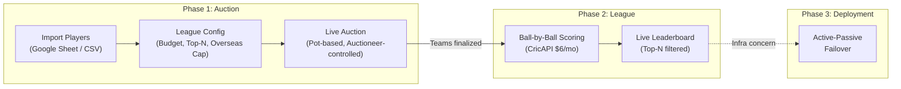
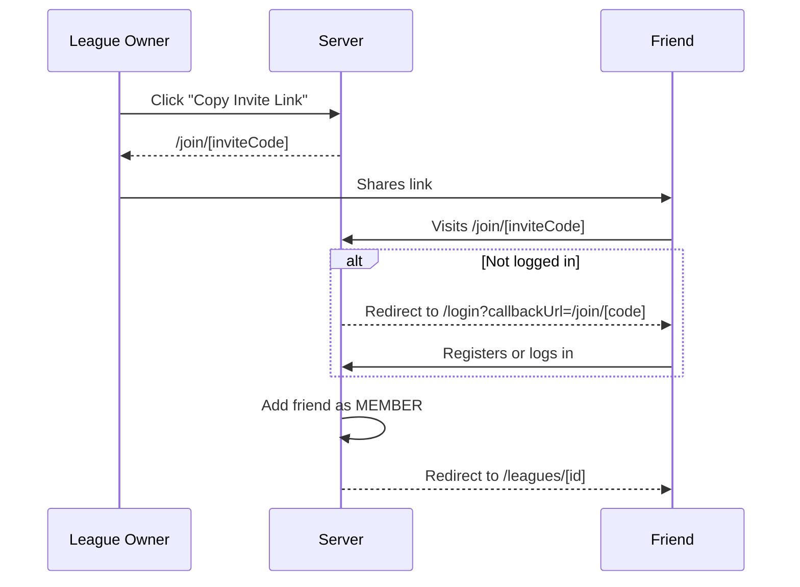
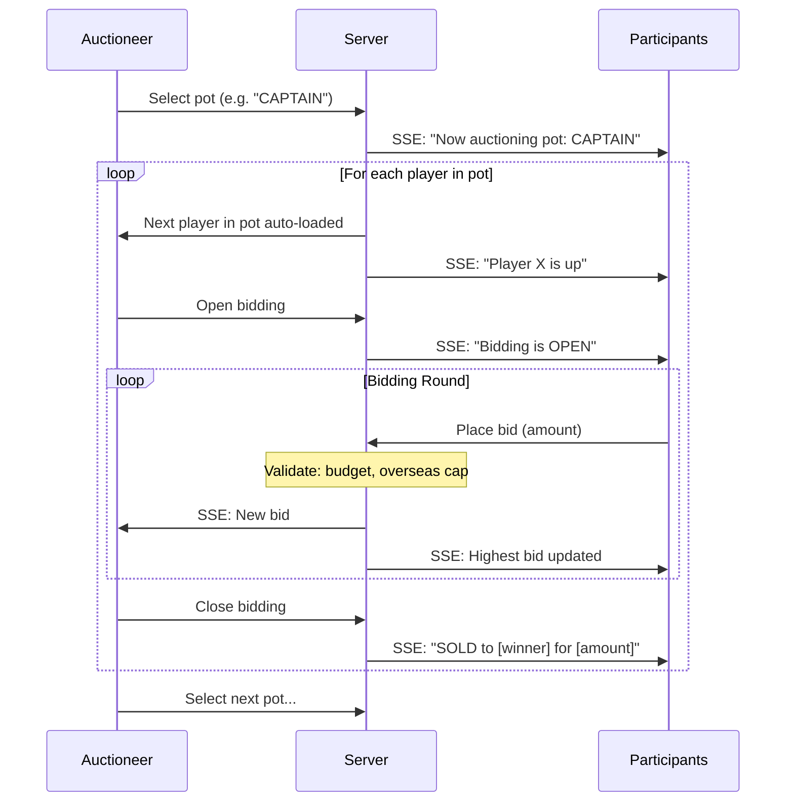
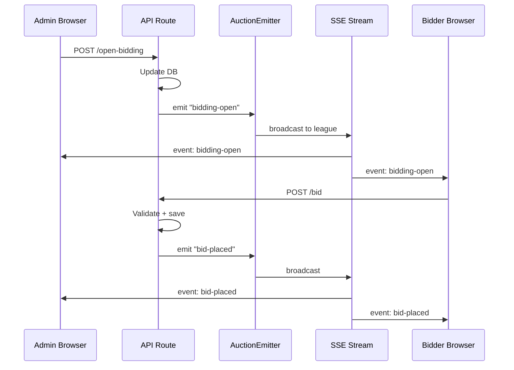
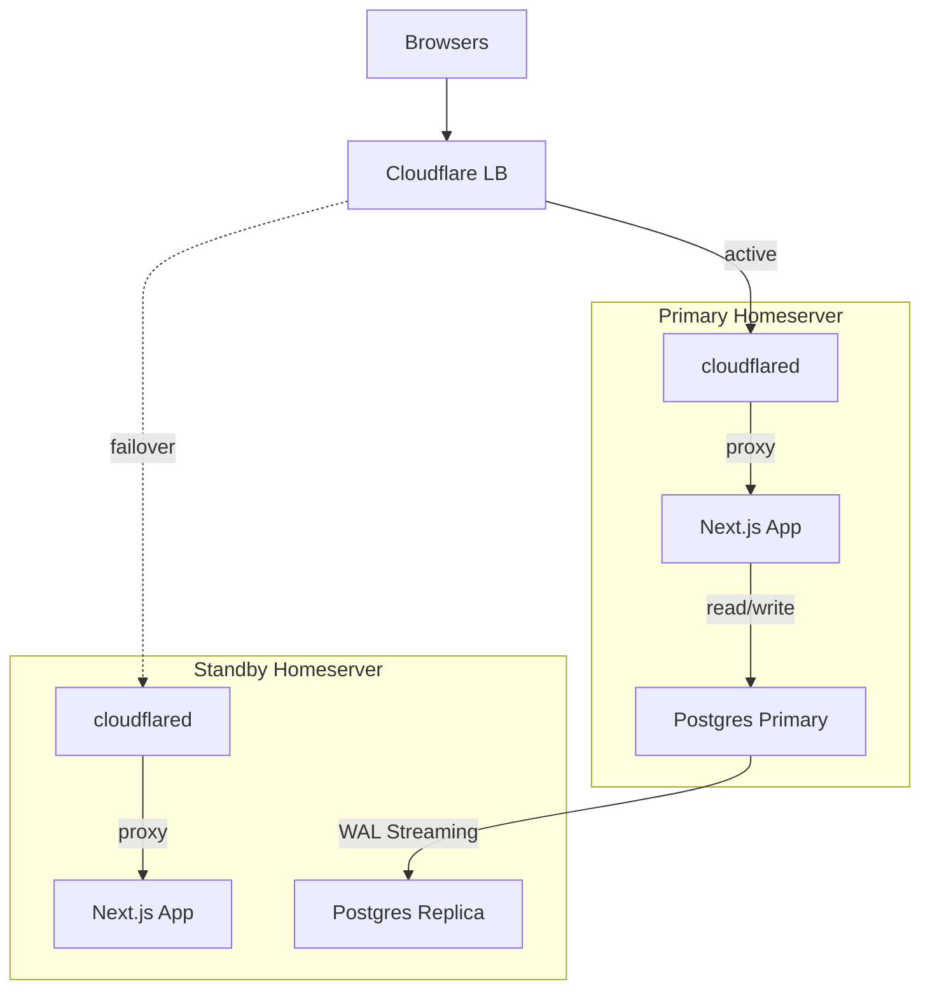

# Player Auction + Fantasy League -- Full Architecture Plan

## Current Implementation Status

| Feature | Status |
|---|---|
| Auth (login / register) | Done |
| League CRUD (create, detail, config) | Done |
| Magic invite links (`/join/[code]`) | Done |
| Player import (Google Sheet URL + CSV upload) | Done |
| Pot-based auction (auctioneer controls, SSE) | Done |
| Live bidding (real-time via SSE) | Done |
| Role promotion (ADMIN role, promote/demote) | Done |
| Team management (create, join, leave, roster) | Done |
| Team-based budgets and bidding | Done |
| Configurable bid increment (default 1 Cr) | Done |
| Upcoming players preview (next 5) | Done |
| Auction pause / resume / end | Done |
| CricAPI integration (ball-by-ball data) | Done |
| Fantasy scoring engine (standard IPL rules) | Done |
| Leaderboard / team pages / match views | Done |
| Player-to-CricAPI mapping (fuzzy match + admin UI) | Done |
| Background scoring poller (instrumentation.ts) | Done |
| Production migrations (Prisma Migrate baseline) | Done |
| Schema audit (FKs, indexes, updatedAt) | Done |
| Docker deployment (Dockerfile, compose, health check) | Done |
| Configurable Postgres port | Done |
| Active-passive failover (Cloudflare Tunnel) | Documented |
| Trading between teams | Future |

---

## Three-Phase Overview



---

## Tech Stack

- **Framework**: Next.js (App Router, TypeScript, Tailwind CSS)
- **Database**: Postgres 15 in Docker
- **ORM**: Prisma
- **Auth**: NextAuth.js (credentials provider)
- **Real-time**: Server-Sent Events (SSE) for auction bids and live scoring
- **Cricket Data**: CricAPI paid plan (~$6/month, 2,000 calls/day)
- **Player Import**: Google Sheets "Publish to Web" CSV URL + manual CSV upload
- **Deployment**: Docker Compose, with Phase 3 active-passive failover across two homeservers

---

## CSV / Google Sheet Column Mapping

The app expects these columns (matching your existing sheet):

| CSV Column | DB Field | Required | Notes |
|---|---|---|---|
| Sl. No | `slNo` | No | Display ordering, auto-generated if missing |
| Name | `name` | Yes | Player name |
| Base Price | `basePrice` | Yes | Numeric, currency symbols stripped |
| Pos | `position` | No | e.g. Batsman, Bowler, All-rounder, WK |
| Country | `country` | Yes | Used to enforce overseas cap (any non-"India" = overseas) |
| Auction Price | `soldPrice` | No | Pre-filled if re-importing after auction |
| Bowling Style | `bowlingStyle` | No | e.g. Right-arm fast, Left-arm spin |
| Batting Style | `battingStyle` | No | e.g. Right-hand bat, Left-hand bat |
| Team | `iplTeam` | No | Current IPL franchise |
| Pot | `pot` | Yes | Auction grouping, e.g. "CAPTAIN", "AR-1", "BAT-2" |

The `pot` field drives the auction flow -- the auctioneer selects a pot, and the app presents players in that pot sequentially.

---

## Phase 1: Auction

### League Setup & Configuration

Before the auction starts, the league owner configures:

- **Budget per team**: Total purse each team can spend (default: 1,00,00,000 / 1 Cr)
- **Top-N scoring rule**: Only the top N players (by fantasy points) from each team count toward the leaderboard in any given match. Configurable via a number input. Example: if N=7 and a team has 11 players, only the 7 highest-scoring players' points count.
- **Overseas player cap**: Maximum number of overseas (non-Indian) players allowed per team. Configurable via a slider (range: 0 to total roster size, default: 4, matching IPL rules). Enforced during bidding -- if a team hits the cap, they cannot bid on more overseas players.
- **Scoring rules**: JSON-based override of default IPL fantasy scoring (optional advanced setting).
- **Google Sheet URL**: Paste the "Publish to Web" CSV URL for live player sync.

All of these are stored on the `League` model and can be edited until the auction starts.

### Player Import (Google Sheet / CSV)

The league owner imports players via two methods during the SETUP phase:

1. **Google Sheet URL**: Paste any Google Sheets URL (edit link, share link, or published link). The server converts it to a CSV export URL, fetches the data, and parses it. The sheet URL is saved on the league for future re-imports.
2. **CSV file upload**: Direct file upload as a fallback.

Both methods use the same CSV parser (`src/lib/csv-parser.ts`) which does flexible header matching (case-insensitive, multiple aliases per column). Re-importing replaces all QUEUED (unsold) players -- already-sold players from a prior auction are preserved.

- **Endpoint**: `POST /api/leagues/[id]/players/import`
- **Google Sheets converter**: `src/lib/sheets.ts` -- handles `/edit`, `/pub`, `/export` URL variants

### League Membership (Invite Links)

Members join a league via magic invite links. The league owner copies a link from the league detail page and shares it (e.g. via WhatsApp).



Each league has a unique `inviteCode` field (auto-generated cuid). The `/join/[code]` server page looks up the league, adds the authenticated user as a MEMBER (idempotent), and redirects to the league detail page. The middleware preserves `callbackUrl` through the auth flow so unauthenticated users land back on the join page after logging in or registering.

### Pot-Based Auction Flow

The auctioneer workflow is organized around pots:



### Auctioneer Dashboard

- **Pot selector**: Dropdown/tabs showing all pots (e.g. CAPTAIN, AR-1, BAT-1, BOWL-1...) with count of remaining players in each
- **Current pot queue**: List of players in the selected pot, with sold/unsold status
- **Current player card**: Name, position, country, batting/bowling style, IPL team, base price
- **Bid controls**: "Open Bidding" / "Close Bidding" / "Skip" / "Undo Last Sale" / "Next Player" / "Previous Player"
- **Live bid feed**: Incoming bids with bidder name, amount, timestamp
- **Budget tracker**: Table showing each team's remaining budget and overseas player count (highlighted when near cap)

### Participant View

- **Current player card**: Full player details (position, country, styles, IPL team, base price)
- **Bid input**: Amount field with validation (must exceed current bid + min increment, must not exceed budget)
- **Quick bid buttons**: Configurable increments
- **Overseas cap indicator**: Warning if you're at the overseas limit and the current player is overseas
- **My team sidebar**: Players won, total spent, budget remaining, overseas count (X/4)
- **Auction log**: All sold players with prices

### Key API Routes (Auction Phase)

| Route | Auth | Description |
|---|---|---|
| `POST /api/auction/[leagueId]/start` | OWNER/ADMIN | Transition from SETUP to AUCTION_ACTIVE |
| `POST /api/auction/[leagueId]/select-pot` | OWNER/ADMIN | Set current pot, load first player |
| `POST /api/auction/[leagueId]/next` | OWNER/ADMIN | Advance to next player in pot |
| `POST /api/auction/[leagueId]/prev` | OWNER/ADMIN | Go back to previous player in pot |
| `POST /api/auction/[leagueId]/open-bidding` | OWNER/ADMIN | Set player status to BIDDING_OPEN |
| `POST /api/auction/[leagueId]/close-bidding` | OWNER/ADMIN | Close bidding, mark SOLD/UNSOLD |
| `POST /api/auction/[leagueId]/skip` | OWNER/ADMIN | Skip current player (mark UNSOLD) |
| `POST /api/auction/[leagueId]/undo` | OWNER/ADMIN | Reverse last sale |
| `POST /api/auction/[leagueId]/pause` | OWNER/ADMIN | Pause active auction |
| `POST /api/auction/[leagueId]/resume` | OWNER/ADMIN | Resume paused auction |
| `POST /api/auction/[leagueId]/end` | OWNER/ADMIN | End auction, mark remaining players UNSOLD |
| `POST /api/auction/[leagueId]/bid` | Any member | Place a bid (validates budget + overseas cap) |
| `GET /api/auction/[leagueId]/stream` | Any member | SSE endpoint for real-time updates |
| `GET /api/auction/[leagueId]/state` | Any member | REST snapshot of full auction state |
| `POST /api/leagues/[id]/members/[memberId]/role` | OWNER/ADMIN | Promote/demote member role |

### Auction Implementation Details

#### Roles

The `MemberRole` enum has three values:

- **OWNER** -- full control: create league, import players, manage auction, promote/demote anyone
- **ADMIN** -- auction control: select pot, open/close bidding, skip, undo, promote members to ADMIN
- **MEMBER** -- can place bids only

Owners and admins can promote members to ADMIN from the league detail page or the auction admin controls. An OWNER's role cannot be changed.

#### Real-Time Architecture (SSE)



- **Event emitter**: `src/lib/auction-events.ts` -- singleton `AuctionEmitter` class wrapping Node's `EventEmitter`, scoped per league ID. Each SSE connection subscribes to its league channel.
- **SSE endpoint**: `GET /api/auction/[leagueId]/stream` -- returns a `ReadableStream` with `text/event-stream` content type. Sends a `state-sync` event on initial connect, then streams incremental events. Includes 15-second keepalive pings.
- **Event types**: `auction-started`, `auction-paused`, `auction-resumed`, `auction-ended`, `pot-selected`, `player-active`, `bidding-open`, `bid-placed`, `bidding-closed`, `player-skipped`, `sale-undone`, `state-sync`

#### Client-Side State Management

The auction page (`/leagues/[id]/auction`) uses a single `useReducer` to manage all auction state, updated from SSE events:

- `auction-view.tsx` -- top-level client component, establishes SSE, dispatches events to reducer
- `auction-admin-controls.tsx` -- pot selector, bid controls, member management (OWNER/ADMIN only)
- `player-card.tsx` -- current player details, highest bid, status badge
- `bid-panel.tsx` -- amount input, quick-bid buttons, budget/overseas-cap warnings
- `team-sidebar.tsx` -- personal team stats, all-teams budget tracker
- `auction-log.tsx` -- scrollable feed of completed sales

#### Shared Helpers

`src/lib/auction-helpers.ts` provides:

- `requireAuctionAdmin()` -- checks OWNER/ADMIN role
- `getAuctionState()` -- full state snapshot (league, players, bids, team budgets, sold log, teams, upcoming players, minBidIncrement)
- `calculateBudgets()` -- per-team budget (`TeamBudgetInfo[]`), spent, remaining, overseas count
- `validateBid()` -- checks bid amount, team budget, overseas cap, min increment; rejects users without a team

### Teams

Members form teams during the SETUP phase. Each team has a shared budget and bids collectively -- any team member can place bids on behalf of the team without consensus.

#### Team Model

```prisma
model Team {
  id       String @id @default(cuid())
  name     String
  leagueId String
  league   League @relation(...)

  members  LeagueMember[]
  bids     Bid[]

  @@index([leagueId])
}
```

- `LeagueMember.teamId` (optional) links a member to a team
- `Player.soldToTeamId` tracks which team purchased the player
- `Bid.teamId` (optional) tracks which team placed the bid
- `League.minBidIncrement` configures the minimum raise per bid (default: 1 Cr / 10,000,000)

#### Team Management APIs

| Route | Auth | Description |
|---|---|---|
| `POST /api/leagues/[id]/teams` | Any member | Create a team (SETUP only), creator auto-joins |
| `POST /api/leagues/[id]/teams/[teamId]/join` | Any member | Join a team (SETUP only), removes from previous team |
| `POST /api/leagues/[id]/teams/[teamId]/leave` | Any member | Leave current team (SETUP only) |
| `GET /api/leagues/[id]/teams/[teamId]` | Any member | Team details: members, purchased players, budget |

#### Team Detail Page

`/leagues/[id]/teams/[teamId]` shows:
- Team name and member list
- Purchased player roster with sold prices
- Budget summary (total / spent / remaining / overseas count)
- Viewable by all league members

#### Team-Based Budget & Bidding

- `calculateBudgets()` returns `TeamBudgetInfo[]` keyed by `teamId` instead of `userId`
- `validateBid()` looks up the bidder's team, checks team budget and overseas cap
- Members without a team cannot place bids
- The auction UI shows team names on bids, sold entries, and the sidebar

#### Configurable Bid Increment

- `League.minBidIncrement` (default: 1 Cr) sets the minimum raise per bid
- Set during league creation, displayed on the league detail page
- Bid panel dynamically scales: quick-bid buttons show `+1x`, `+2x`, `+5x`, `+10x` of the increment
- The `step` attribute on the bid input matches the increment

#### Upcoming Players Preview

During an auction, the UI shows the next 5 queued players in the current pot as compact cards below the current player card. Each card displays: name, position, country (overseas highlighted), and base price. Players already SOLD or UNSOLD are skipped.

---

## Phase 2: League (Fantasy Scoring During IPL)

### Cricket Data: CricAPI (cricketdata.org)

Using **cricketdata.org's paid plan** (2,000 calls/day, ~$6/month). Base URL: `https://api.cricapi.com/v1`.

**Endpoints used:**
- `GET /v1/currentMatches` -- list live/recent matches
- `GET /v1/match_scorecard?id=MATCH_ID` -- detailed batting/bowling/catching scorecard
- `GET /v1/match_squad?id=MATCH_ID` -- squad info for player mapping
- `GET /v1/series_info?id=SERIES_ID` -- series info with match list
- `GET /v1/match_points?id=MATCH_ID` -- pre-calculated fantasy points (cross-check)

**Implementation files:**
- `src/lib/cricapi.ts` -- API client with typed responses
- `src/lib/scoring.ts` -- Fantasy scoring engine with configurable rules
- `src/lib/scoring-poller.ts` -- Background poller (30s live, 5min idle)
- `src/lib/scoring-events.ts` -- SSE emitter for live score updates
- `src/lib/player-matcher.ts` -- Fuzzy matching for player-to-CricAPI mapping
- `src/instrumentation.ts` -- Starts the scoring poller on server boot

**Player matching**: The `name` + `iplTeam` fields from your CSV are used to fuzzy-match against CricAPI's player database via Levenshtein distance. An admin UI (`/leagues/[id]/players/map`) lets the admin confirm or correct matches. Mapped players get their `externalId` set.

### Top-N Scoring System

**Only the top N players per team score points in each match.**

1. The scoring poller fetches scorecards every 30s during live matches
2. `calculateMatchFantasyPoints()` computes points per player from raw scorecard data
3. Results are stored in `PlayerPerformance` records (upserted per player per match)
4. The standings API ranks players per team per match, sums top N, and aggregates across matches

The top-N cutoff is stored as `scoringTopN` on the `League` model and can be adjusted between matches (but not during a live match).

### Standard IPL Fantasy Scoring Rules

Stored as a JSON config on each league (`scoringRules`), with these defaults (in `DEFAULT_SCORING_RULES`):

- **Batting**: 1pt/run, +1/four, +2/six, +8 half-century, +16 century, -2 duck, SR penalties (<60: -6, <80: -2, >170: +4, >200: +6, min 10 balls)
- **Bowling**: +25/wicket, +8 maiden, +8 four-fer, +16 five-fer, economy bonuses/penalties (<4: +6, <6: +4, >10: -4, >12: -6, min 2 overs)
- **Fielding**: +8/catch, +12/stumping, +6/run out

### League Phase API Routes

| Route | Auth | Description |
|---|---|---|
| `POST /api/leagues/[id]/phase` | OWNER/ADMIN | Transition phase (AUCTION_COMPLETE -> LEAGUE_ACTIVE -> LEAGUE_COMPLETE) |
| `POST /api/leagues/[id]/matches/sync` | OWNER/ADMIN | Sync matches from CricAPI series |
| `GET /api/leagues/[id]/standings` | Any member | Leaderboard with top-N per match |
| `GET /api/leagues/[id]/matches` | Any member | List matches with status |
| `GET /api/leagues/[id]/matches/[matchId]` | Any member | Match detail with player performances |
| `GET /api/leagues/[id]/players/map` | OWNER/ADMIN | Get player mapping suggestions |
| `POST /api/leagues/[id]/players/map` | OWNER/ADMIN | Save player-to-CricAPI mappings |
| `GET /api/leagues/[id]/scoring/stream` | Any member | SSE for live scoring updates |

### League Phase UI Pages

- **Live Leaderboard** (`/leagues/[id]/standings`) -- Team rankings with expandable match-by-match breakdown, live SSE updates
- **Match List** (`/leagues/[id]/matches`) -- Grouped by Live/Upcoming/Completed with status badges
- **Match Detail** (`/leagues/[id]/matches/[matchId]`) -- Player performance table with batting/bowling/fielding tabs, team ownership highlights
- **Player Mapping** (`/leagues/[id]/players/map`) -- Admin UI for fuzzy-matching league players to CricAPI IDs
- **League Actions** -- Phase transitions and match sync controls on the league detail page

---

## Phase 3: Deployment & Failover

### Docker Deployment

The app ships with:
- `Dockerfile` -- Multi-stage build (deps -> build -> standalone runner)
- `docker-compose.yml` -- Dev: Postgres only, configurable port via `POSTGRES_PORT`
- `docker-compose.prod.yml` -- Production: Postgres + App, health checks, env vars
- `GET /api/health` -- Returns `{ status, db, timestamp }` with 200/503

See `DEPLOYMENT.md` for full setup instructions.

### Configurable Postgres Port

Set `POSTGRES_PORT` in `.env` to use a non-standard port (e.g., `5433` when another Postgres is on 5432). The Docker Compose files use `${POSTGRES_PORT:-5432}:5432` for host mapping.

### Database Migrations

Switched from `prisma db push` (dev-only) to `prisma migrate` for production safety:
- `prisma/migrations/0_init/` -- Baseline migration from existing schema
- `prisma/migrations/20260322.../` -- Schema audit (FKs, indexes, updatedAt, new fields)
- Dev: `npm run db:migrate` / Prod: `npm run db:migrate:deploy`

### Active-Passive Failover (Cloudflare Tunnel)



1. Each server runs `cloudflared tunnel` connecting to Cloudflare
2. Cloudflare Load Balancer routes to active tunnel based on `/api/health` checks
3. Postgres streaming replication keeps standby DB in sync (seconds of lag)
4. On failover: Cloudflare switches traffic, standby Postgres is promoted
5. See `DEPLOYMENT.md` for full Cloudflare Tunnel + replication setup

---

## Future: Trading Between Teams

Schema is scaffolded (`Trade` + `TradeItem` models). Not built yet. Supports:

- Propose / accept / reject / counter-offer flow
- Trade windows, budget balancing, overseas cap enforcement
- League owner veto, multi-player trades, full audit log
