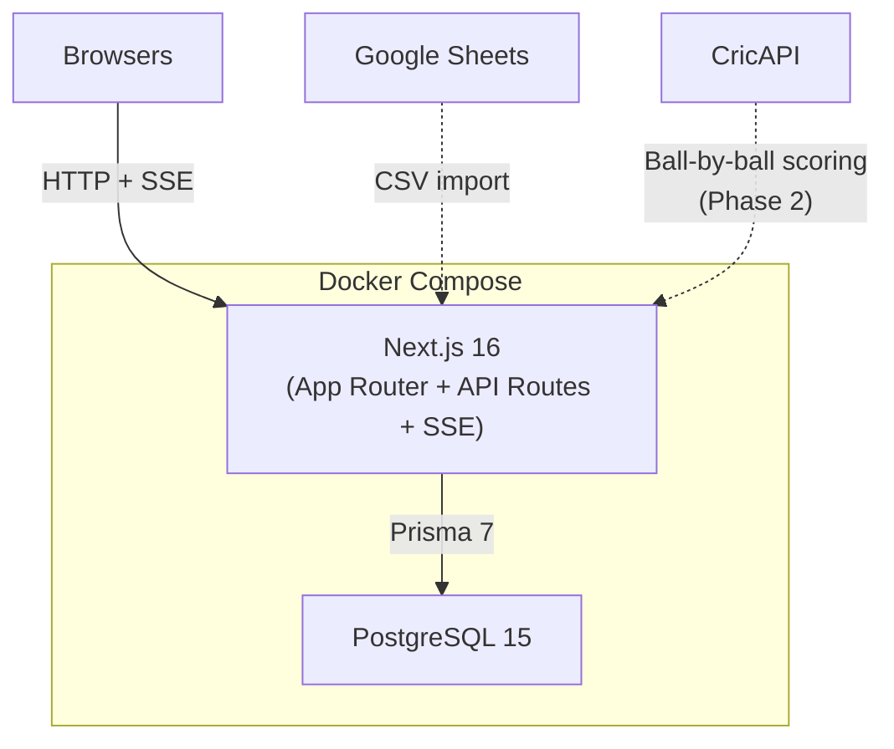

# Player Auction + Fantasy League

IPL-style player auction and fantasy league platform for a group of friends.

See [PLAN.md](PLAN.md) for the full architecture plan.

## Architecture



## Features

| Feature | Status |
|---|---|
| Auth (login / register, JWT sessions) | Done |
| League creation + configuration | Done |
| Magic invite links | Done |
| Player import (Google Sheet URL + CSV) | Done |
| Pot-based live auction | Done |
| Real-time bidding (SSE) | Done |
| Role promotion (ADMIN role) | Done |
| CricAPI ball-by-ball scoring | Planned |
| Fantasy leaderboard + team pages | Planned |
| Active-passive failover | Planned |
| Trading between teams | Future |

## Tech Stack

- **Next.js 16** (App Router, TypeScript, Tailwind CSS v4)
- **PostgreSQL 15** (via Docker)
- **Prisma 7** (ORM with PG driver adapter)
- **NextAuth.js v5** (credentials-based JWT auth)

## Project Structure

```
src/
  app/
    (auth)/login/         Login page
    (auth)/register/      Register page
    api/auth/             NextAuth handlers + registration endpoint
    api/leagues/          League CRUD API
    api/leagues/[id]/players/import/   Player import API
    api/leagues/[id]/members/[memberId]/role/  Role promotion API
    api/auction/[leagueId]/  Auction control APIs (10 endpoints)
    join/[code]/          Magic invite link handler
    leagues/              League list
    leagues/create/       Create league form
    leagues/[id]/         League detail (members, players, import UI)
    leagues/[id]/auction/ Live auction page (admin + bidder views)
  lib/
    auth.ts               NextAuth config (Prisma + bcrypt)
    auth.config.ts        Edge-safe auth config (middleware)
    prisma.ts             Prisma client singleton
    csv-parser.ts         CSV parser with flexible header matching
    sheets.ts             Google Sheets URL converter + fetcher
    auction-events.ts     SSE event emitter (per-league broadcast)
    auction-helpers.ts    Auction validation + state helpers
prisma/
  schema.prisma           Database schema (11 models)
```

## Getting Started

### Prerequisites

- Node.js 20+
- Docker (for PostgreSQL)

### Setup

```bash
git clone <repo-url>
cd player-auction
npm install
docker compose up -d
cp .env.example .env
npx prisma generate
npx prisma db push
npm run dev
```

Open [http://localhost:3000](http://localhost:3000)

### Inviting Friends

1. Create a league from the dashboard
2. On the league detail page, copy the invite link
3. Share it with friends -- they'll be prompted to register/login, then auto-join

### Importing Players

On the league detail page (SETUP phase), the owner can:

1. **Google Sheet**: Paste any Google Sheets URL and click "Import"
2. **CSV file**: Upload a `.csv` file directly

Expected columns: `Name`, `Base Price`, `Pot` (required), plus optional `Sl. No`, `Pos`, `Country`, `Bowling Style`, `Batting Style`, `Team`, `Auction Price`.

### Running the Auction

1. Import players and invite all members
2. Click "Start Auction" on the league page (or enter the auction view)
3. **Admin controls**: Select a pot, navigate players, open/close bidding, skip, undo
4. **Bidder view**: Place bids when bidding is open, track budget in the sidebar
5. Promote members to Admin from the league page or auction controls to let them co-manage

## Scripts

| Command | Description |
|---|---|
| `npm run dev` | Start development server |
| `npm run build` | Production build |
| `npm run start` | Start production server |
| `npm run db:generate` | Regenerate Prisma client |
| `npm run db:push` | Push schema to database |
| `npm run db:migrate` | Run database migrations |
| `npm run db:studio` | Open Prisma Studio GUI |
