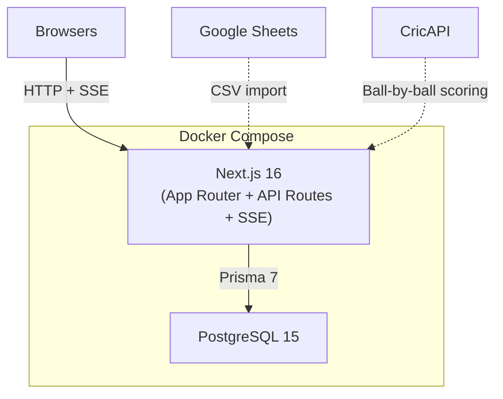

# Player Auction + Fantasy League

IPL-style player auction and fantasy league platform for a group of friends.

See [PLAN.md](PLAN.md) for the full architecture plan and [DEPLOYMENT.md](DEPLOYMENT.md) for production setup.

## Architecture



## Features

| Feature | Status |
|---|---|
| Auth (login / register, JWT sessions) | Done |
| League creation + configuration | Done |
| Magic invite links | Done |
| Player import (Google Sheet URL + CSV) | Done |
| Pot-based live auction | Done |
| Real-time bidding (SSE) | Done |
| Role promotion (ADMIN role) | Done |
| Team management (create, join, shared budget) | Done |
| Team-based bidding + configurable increment | Done |
| Upcoming players preview (next 5) | Done |
| Auction pause / resume / end | Done |
| CricAPI integration (scorecard + squad) | Done |
| Fantasy scoring engine (configurable rules) | Done |
| Background scoring poller (live matches) | Done |
| Leaderboard with top-N per match | Done |
| Match list + detail pages | Done |
| Player-to-CricAPI mapping (fuzzy match UI) | Done |
| Production migrations (Prisma Migrate) | Done |
| Docker deployment (Dockerfile + compose) | Done |
| Health check endpoint | Done |
| Configurable Postgres port | Done |
| Active-passive failover (Cloudflare) | Documented |
| Trading between teams | Future |

## Tech Stack

- **Next.js 16** (App Router, TypeScript, Tailwind CSS v4)
- **PostgreSQL 15** (via Docker)
- **Prisma 7** (ORM with PG driver adapter, Prisma Migrate)
- **NextAuth.js v5** (credentials-based JWT auth)
- **CricAPI** (cricketdata.org, paid plan for live scoring)

## Project Structure

```
src/
  app/
    (auth)/login/         Login page
    (auth)/register/      Register page
    api/auth/             NextAuth handlers + registration endpoint
    api/health/           Health check endpoint (for load balancer)
    api/leagues/          League CRUD API
    api/leagues/[id]/players/import/   Player import API
    api/leagues/[id]/players/map/      Player-to-CricAPI mapping API
    api/leagues/[id]/members/[memberId]/role/  Role promotion API
    api/leagues/[id]/teams/            Team CRUD (create, join, leave, detail)
    api/leagues/[id]/phase/            League phase transitions
    api/leagues/[id]/matches/          Match list + sync API
    api/leagues/[id]/matches/[matchId]/  Match detail API
    api/leagues/[id]/standings/        Leaderboard API
    api/leagues/[id]/scoring/stream/   SSE for live scoring
    api/auction/[leagueId]/  Auction control APIs (13 endpoints)
    join/[code]/          Magic invite link handler
    leagues/              League list
    leagues/create/       Create league form
    leagues/[id]/         League detail (members, teams, players, import UI)
    leagues/[id]/auction/ Live auction page (admin + bidder views)
    leagues/[id]/teams/[teamId]/  Team detail page (roster, budget)
    leagues/[id]/standings/  Fantasy leaderboard
    leagues/[id]/matches/    Match list
    leagues/[id]/matches/[matchId]/  Match detail with player performances
    leagues/[id]/players/map/  Admin player mapping UI
  lib/
    auth.ts               NextAuth config (Prisma + bcrypt)
    auth.config.ts        Edge-safe auth config (middleware)
    prisma.ts             Prisma client singleton
    csv-parser.ts         CSV parser with flexible header matching
    sheets.ts             Google Sheets URL converter + fetcher
    auction-events.ts     SSE event emitter (per-league broadcast)
    auction-helpers.ts    Auction validation + state helpers
    cricapi.ts            CricAPI client (scorecard, squad, series)
    scoring.ts            Fantasy scoring engine + rules
    scoring-events.ts     SSE emitter for live scoring
    scoring-poller.ts     Background poller for live match updates
    player-matcher.ts     Name + franchise matching; auto-map thresholds for CricAPI ids
  instrumentation.ts      Starts scoring poller on server boot
prisma/
  schema.prisma           Database schema (11 models)
  migrations/             Prisma Migrate migration history
```

## Getting Started

### Prerequisites

- [Bun](https://bun.sh) 1.x+
- Docker (for PostgreSQL)

### Setup

```bash
git clone <repo-url>
cd player-auction
bun install
docker compose up -d
cp .env.example .env
bunx prisma generate
bunx prisma migrate dev
bun run dev
```

Open [http://localhost:3000](http://localhost:3000)

### Inviting Friends

1. Create a league from the dashboard
2. On the league detail page, copy the invite link
3. Share it with friends -- they'll be prompted to register/login, then auto-join

### Importing Players

On the league detail page (SETUP phase), the owner can:

1. **Google Sheet**: Paste any Google Sheets URL and click "Import"
2. **CSV file**: Upload a `.csv` file directly

Expected columns: `Name`, `Base Price`, `Pot` (required), plus optional `Sl. No`, `Pos`, `Country`, `Bowling Style`, `Batting Style`, `Team`, `Auction Price`.

### Setting Up Teams

1. On the league detail page (SETUP phase), create a team with a name
2. Other members can join your team or create their own
3. Each team shares a single budget -- any team member can bid on behalf of the team
4. Team rosters and budgets are visible on the team detail page

### Running the Auction

1. Import players, invite all members, and ensure everyone has joined a team
2. Click "Start Auction" on the league page (or enter the auction view)
3. **Admin controls**: Select a pot, navigate players, open/close bidding, skip, undo
4. **Pause/Resume**: Admins can pause/resume the auction at any time
5. **End Auction**: Admins can end the auction early; remaining players are marked UNSOLD
6. **Bidder view**: Place bids when bidding is open, see upcoming players, track team budget in the sidebar
7. Promote members to Admin from the league page or auction controls to let them co-manage

### Starting the Fantasy League

1. After the auction completes, click "Start League Phase"
2. **Sync Matches**: Enter the CricAPI series ID to import the IPL match schedule
3. **Map Players**: Use the mapping UI to link league players to CricAPI player IDs
4. The scoring poller runs automatically, updating scores every 30 seconds during live matches
5. View the **Leaderboard** for team standings and **Matches** for individual match details

### Production Deployment

See [DEPLOYMENT.md](DEPLOYMENT.md) for Docker deployment, configurable Postgres port, and Cloudflare failover setup.

## Scripts

| Command | Description |
|---|---|
| `bun run dev` | Start development server |
| `bun run build` | Production build |
| `bun run start` | Start production server |
| `bun run db:generate` | Regenerate Prisma client |
| `bun run db:push` | Push schema (dev only, no migration) |
| `bun run db:migrate` | Create + apply migration (dev) |
| `bun run db:migrate:deploy` | Apply pending migrations (production) |
| `bun run db:migrate:reset` | Reset database (dev only, destroys data) |
| `bun run db:studio` | Open Prisma Studio GUI |
